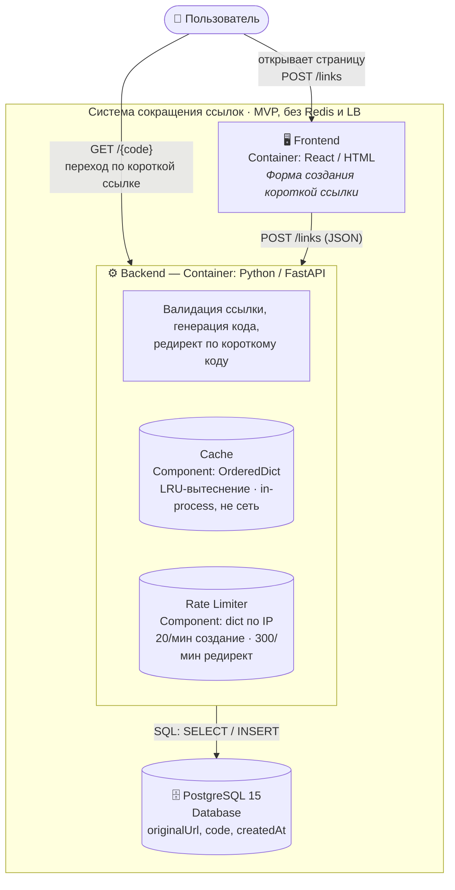
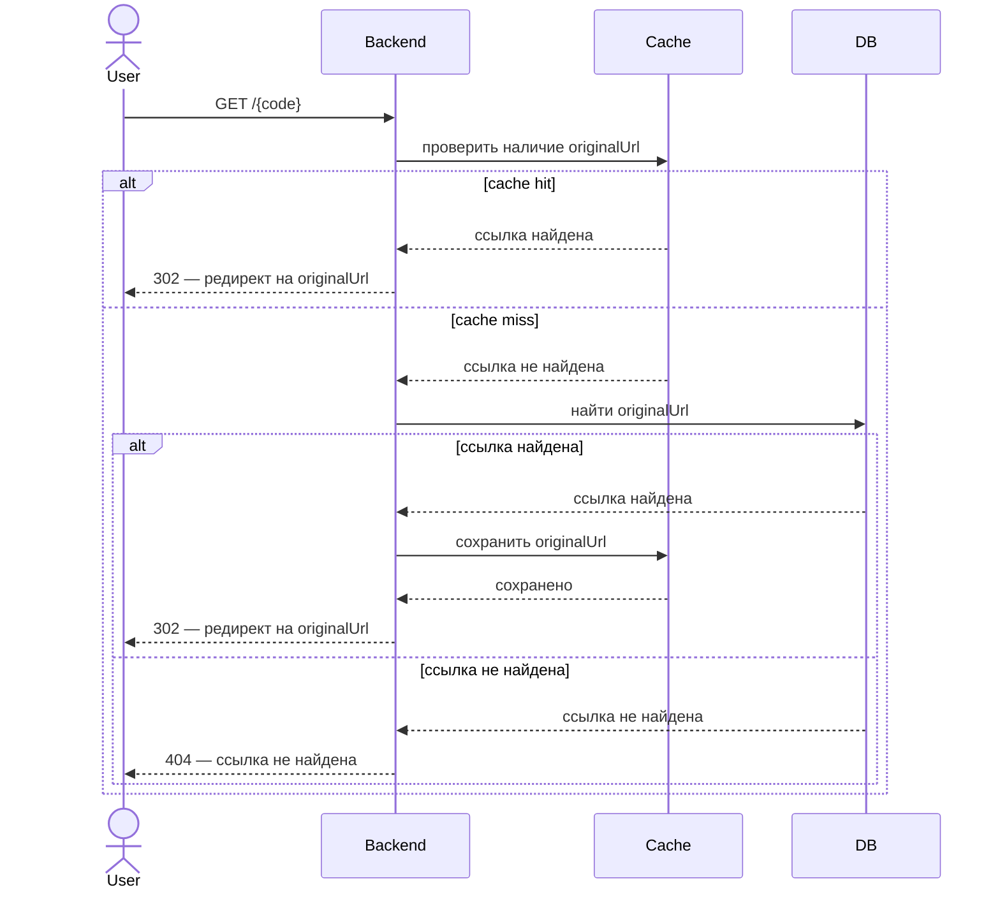
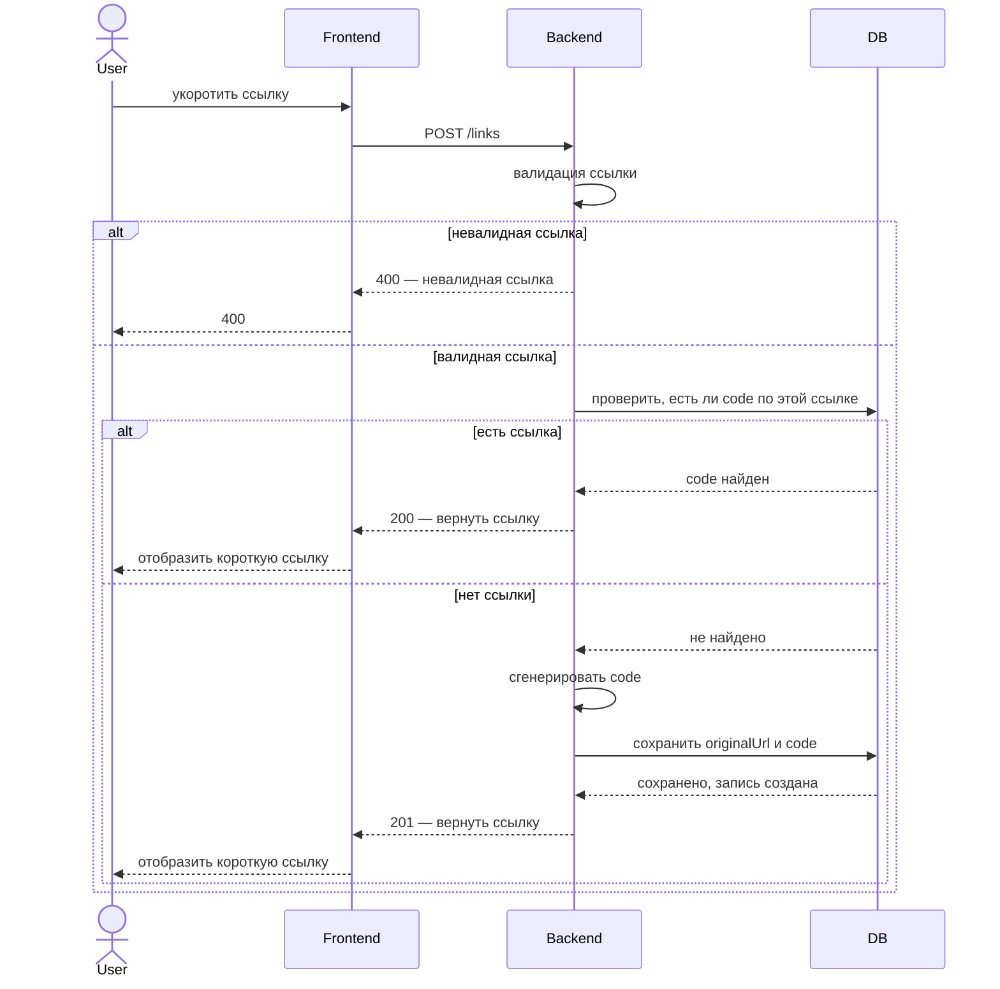
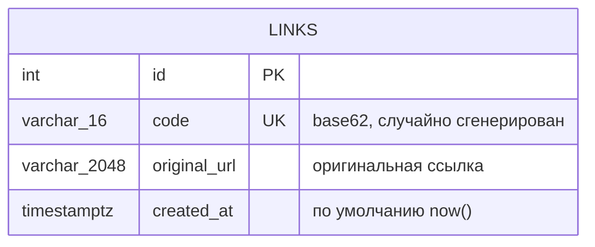

# shortener

> Архитектура, ТЗ, диаграммы и API-спецификация — [AliceMazh](https://github.com/alisamagarova); реализация кода — Claude.

Для версии без Redis и LB

ФТ:
1. Система должна проверять поле ввода оригинального URL на валидность перед созданием короткой ссылки. Ссылка считается валидной, если: она является синтаксически корректным URL (содержит схему и хост); использует схему http или https (остальные схемы, включая ftp, javascript, data, отклоняются); не является пустой строкой; не превышает 2048 символов. Если хотя бы одно из условий не выполнено — система должна вернуть 400 с описанием причины отклонения
2. При получении оригинальной ссылки система должна проверить наличие в базе данных уже такой ссылки и если ее нет сгенерировать код и выдать короткую ссылку, иначе выдать уже существующую короткую ссылку
3. При нажатии на короткую ссылку система должна осуществить редирект на оригинальную ссылку, иначе выдать 404
4. Короткая ссылка должна оставаться активной бессрочно

НФТ:
1. Система должна укорачивать ссылку не дольше чем за 150мс
2. Система должна быть доступна 99,95% времени в году
3. При создании укороченной ссылки допустима пропускная способность не более 20 запросов в минуту с одного IP
4. При редиректе допустима пропускная способность не большее 300 в минуту с однгого IP
5. При превышение объема кэша система должна вытеснять наименее недавно использованные записи(LRU), чтобы часто запрашиваемые ссылки оставались доступны для быстрого чтения
6. Система должна гарантировать уникальность каждого сгенерированного code, коллизии кодов недопустимы
7. Общая пропускная способность не менее 50 запросов в секунду суммарно

## Архитектура



Кэш и rate limiter — это компоненты внутри процесса backend (не отдельные сервисы и не Redis), поэтому состояние не переживает перезапуск и не шарится между несколькими инстансами backend — это осознанное упрощение для MVP.

### Сценарий: редирект по короткой ссылке



### Сценарий: создание короткой ссылки



## Модель данных



Таблица `links` в PostgreSQL:

| Колонка        | Тип в PostgreSQL          | Ограничения                          | Описание                                                   |
|----------------|----------------------------|---------------------------------------|--------------------------------------------------------------|
| `id`           | `SERIAL` / `INTEGER`       | `PRIMARY KEY`                         | Уникальный идентификатор записи                              |
| `code`         | `VARCHAR(16)`               | `UNIQUE NOT NULL`, индекс             | Короткий код ссылки (7 символов, алфавит `[0-9a-zA-Z]`)      |
| `original_url` | `VARCHAR(2048)`             | `NOT NULL`, индекс                    | Оригинальная (длинная) ссылка, до 2048 символов               |
| `created_at`   | `TIMESTAMPTZ`               | `NOT NULL DEFAULT now()`              | Дата и время создания записи, ссылка активна бессрочно (ФТ №4) |

Уникальность `code` гарантируется уникальным индексом в БД: при коллизии сгенерированного кода backend перегенерирует код и повторяет попытку сохранения (НФТ №6).

## Технологический стек

| Слой      | Технология                                            |
|-----------|--------------------------------------------------------|
| Frontend  | Статический HTML/CSS/JS, без сборки, раздаётся nginx    |
| Backend   | Python 3.12, FastAPI, SQLAlchemy, Uvicorn               |
| Кэш       | `OrderedDict` в памяти процесса backend (LRU)           |
| Rate limit| `dict` в памяти процесса backend, скользящее окно 60с   |
| БД        | PostgreSQL 15                                           |
| Инфра     | Docker Compose (db, backend, frontend)                  |

## Структура проекта

```
shortener/
├── api/
│   └── links.json          # OpenAPI-спецификация API
├── backend/
│   ├── app/
│   │   ├── main.py         # FastAPI-приложение, роуты
│   │   ├── config.py       # Настройки из переменных окружения
│   │   ├── database.py     # SQLAlchemy engine/session
│   │   ├── models.py       # ORM-модель Link
│   │   ├── schemas.py      # Pydantic-схемы запросов/ответов
│   │   ├── service.py      # Бизнес-логика (get_or_create, resolve_code)
│   │   ├── cache.py        # LRU-кэш (OrderedDict)
│   │   ├── rate_limiter.py # Rate limiter по IP
│   │   ├── codegen.py      # Генерация короткого кода
│   │   └── validation.py   # Валидация originalUrl
│   ├── requirements.txt
│   └── Dockerfile
├── frontend/
│   ├── index.html          # Страница с формой сокращения ссылки
│   ├── style.css
│   ├── script.js
│   ├── nginx.conf          # Проксирование /api/ на backend
│   └── Dockerfile
├── docker-compose.yml
└── .env.example
```

## Быстрый старт

```bash
cp .env.example .env
docker compose up --build
```

- Frontend: http://localhost:3000
- Backend API: доступен через frontend по адресу http://localhost:3000/api/v1 (nginx проксирует `/api/` на backend внутри docker-сети — backend и PostgreSQL наружу порты не публикуют)

Для прямого доступа к backend/PostgreSQL с хоста (например, для отладки) временно добавьте `ports` в `docker-compose.override.yml` или используйте `docker compose exec db psql ...`.

Инструкция по деплою на одну ВМ в Яндекс.Облаке (Compute Cloud) — в [DEPLOY.md](DEPLOY.md). Также можно развернуть через [Coolify](https://coolify.io/) как Docker Compose-приложение из этого же репозитория.

## API

Полная спецификация — в [api/links.json](api/links.json). Базовый префикс backend: `/api/v1`.

| Метод | Путь            | Описание                                                        |
|-------|------------------|--------------------------------------------------------------------|
| POST  | `/api/v1/links`  | Создать короткую ссылку. `201` — создана новая, `200` — уже существовала, `400` — невалидный `originalUrl`, `429` — превышен лимит (20/мин с IP) |
| GET   | `/api/v1/{code}` | Редирект на оригинальную ссылку. `302` — редирект, `404` — не найдена, `429` — превышен лимит (300/мин с IP) |

Пример запроса на создание ссылки:

```bash
curl -X POST http://localhost:8000/api/v1/links \
  -H "Content-Type: application/json" \
  -d '{"originalUrl": "https://example.com/very/long/path"}'
```

## Переменные окружения

| Переменная                       | По умолчанию | Описание                                   |
|------------------------------------|--------------|-----------------------------------------------|
| `DATABASE_URL`                     | —            | Строка подключения к PostgreSQL                |
| `MAX_URL_LENGTH`                   | `2048`       | Максимальная длина `originalUrl` (ФТ №1)       |
| `CODE_LENGTH`                      | `7`          | Длина генерируемого `code`                     |
| `CACHE_MAX_SIZE`                   | `1000`       | Ёмкость LRU-кэша (НФТ №5)                       |
| `RATE_LIMIT_CREATE_PER_MINUTE`     | `20`         | Лимит создания ссылок с одного IP (НФТ №3)      |
| `RATE_LIMIT_REDIRECT_PER_MINUTE`   | `300`        | Лимит редиректов с одного IP (НФТ №4)           |
| `API_PREFIX`                       | `/api/v1`    | Префикс путей backend API                       |
| `CORS_ORIGINS`                     | `*`          | Разрешённые origin для CORS                     |
