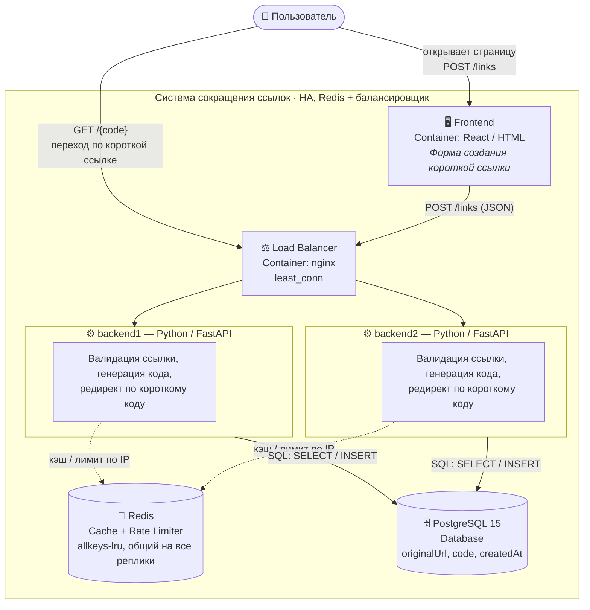

# shortener · HA (Redis + балансировщик)

Тот же сервис, что в [mvp/](../mvp/), но с общим состоянием между несколькими
инстансами backend: кэш и rate limiter вынесены в Redis, перед репликами
backend стоит nginx-балансировщик. Общее ФТ/НФТ — в [корневом README](../README.md).

## Чем отличается от MVP

В MVP-варианте кэш (`OrderedDict`) и rate limiter (`dict`) живут в памяти одного
процесса backend — если инстансов несколько, у каждого своё, независимое состояние:
лимит `20 запросов/мин с IP` на деле стал бы `20 × N` инстансов, а закешированная
на одной реплике ссылка не была бы видна другой. В HA-варианте это состояние
вынесено в Redis — общее на все реплики backend, поэтому лимиты и кэш остаются
корректными независимо от того, сколько реплик сейчас поднято.

| | MVP | HA |
|---|---|---|
| Кэш | `OrderedDict` в памяти процесса | Redis, `maxmemory-policy allkeys-lru` |
| Rate limiter | `dict` в памяти процесса | Redis, `INCR`/`EXPIRE`, окно 60с |
| Backend | 1 инстанс | 2 реплики (`backend1`, `backend2`) за LB |
| Балансировщик | нет | nginx, `least_conn` |

## Архитектура



## Структура

```
ha/
├── backend/
│   ├── app/
│   │   ├── main.py         # FastAPI-приложение, роуты
│   │   ├── config.py       # Настройки, включая REDIS_URL
│   │   ├── database.py     # SQLAlchemy engine/session
│   │   ├── models.py       # ORM-модель Link
│   │   ├── schemas.py      # Pydantic-схемы запросов/ответов
│   │   ├── service.py      # Бизнес-логика (get_or_create, resolve_code)
│   │   ├── cache.py        # Кэш code -> originalUrl в Redis
│   │   ├── rate_limiter.py # Rate limiter по IP в Redis
│   │   ├── codegen.py      # Генерация короткого кода
│   │   └── validation.py   # Валидация originalUrl
│   ├── requirements.txt    # + redis
│   └── Dockerfile
├── frontend/                # то же, что в mvp/, nginx проксирует /api/ на lb
├── lb/
│   ├── nginx.conf           # upstream backend1/backend2, least_conn
│   └── Dockerfile
├── docker-compose.yml       # db, redis, backend1, backend2, lb, frontend
└── .env.example
```

Общая OpenAPI-спецификация — в [../api/links.json](../api/links.json), контракт API идентичен MVP-варианту.

## Быстрый старт

```bash
cd ha
cp .env.example .env
docker compose up --build
```

- Frontend: http://localhost:3000
- Backend API: через frontend на http://localhost:3000/api/v1 (frontend → lb → backend1/backend2, порты БД/Redis/backend наружу не публикуются)

Проверить, что балансировка действительно работает, можно по логам реплик:

```bash
docker compose logs -f backend1 backend2
```

При повторных запросах на `/api/v1/{code}` видно, что их обрабатывают то `backend1`, то `backend2`.

В Coolify заводится как отдельное приложение: тот же репозиторий, Base directory `ha`, Docker compose location `/docker-compose.yml`.

## Переменные окружения

Общие с MVP (`MAX_URL_LENGTH`, `CODE_LENGTH`, `RATE_LIMIT_CREATE_PER_MINUTE`, `RATE_LIMIT_REDIRECT_PER_MINUTE`,
`API_PREFIX`, `CORS_ORIGINS`, `FRONTEND_PORT`, `POSTGRES_*`) — см. [../mvp/README.md](../mvp/README.md#переменные-окружения).
Дополнительно:

| Переменная         | По умолчанию | Описание                                                    |
|---------------------|--------------|----------------------------------------------------------------|
| `REDIS_MAXMEMORY`   | `64mb`       | Лимит памяти Redis; при превышении вытесняются LRU-записи (НФТ №5) |

`CACHE_MAX_SIZE` (из MVP) здесь не используется — ёмкость кэша ограничивается `REDIS_MAXMEMORY`, а не числом записей.

## Дальнейшие шаги

- PostgreSQL здесь всё ещё один инстанс — для полного устранения единой точки отказа
  стоит перейти на managed/реплицированный Postgres (например, Managed PostgreSQL в
  Яндекс.Облаке).
- Redis тоже единственный — при необходимости можно поднять Redis Sentinel/Cluster,
  но для кэша (не источника истины) потеря Redis не критична: backend просто снова
  начнёт читать из PostgreSQL.
- Число реплик backend сейчас фиксировано (`backend1`, `backend2`) — при желании
  можно добавить `backend3` и т.д. по тому же шаблону через YAML-anchor `&backend-common`.
